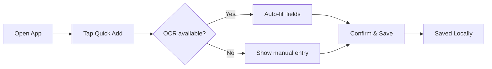

# Finance Tracker — UX Design Specification

_Created on 2025-11-13 by BMad_

---

## Executive summary

Privacy-first, offline-capable mobile app for personal finance focused on fast transaction capture, local OCR-based receipt scanning, predefined categorization, clear visual reports, and manual CSV backup.

This document summarizes the core UX direction, components, patterns, and implementation-ready outputs for the Finance Tracker MVP.

---

## 1. Project vision (from product brief)

- Privacy-first, offline-capable mobile app for personal finance
- Fast transaction capture (target: ≤3 taps)
- Offline OCR receipt/invoice scanning with user confirmation and editable parsed fields
- Local encrypted storage with optional PIN/biometric lock
- Simple visual reports (pie + bar charts) and manual CSV export/import

## 2. Target users

- Privacy-conscious individuals who prefer local-only data storage
- Mobile-first users who want low-friction transaction capture
- People who want simple, clear visual reports and manual backup options

## 3. Key goals & success criteria

- Fast add transaction flow: ≤3 taps; mean time under ~10s
- OCR extraction accuracy: target ≥80% for key fields before correction
- Reports: pie and bar charts for monthly/yearly summaries (usable offline)
- Data stored encrypted on device; no mandatory cloud sync
- CSV export/import round-trip without data loss

## 4. Core features (MVP)

- Fast add/edit/delete transactions (amount, date, predefined category, type, notes)
- Predefined category set: Food, Transport, Utilities, Entertainment, Shopping, Healthcare, Other
- Offline OCR-based receipt/invoice scanning with confirmation UI and editable parsed fields
- Recurring transactions (daily/weekly/monthly/yearly) without notifications
- Visual reports: pie chart by category; bar chart by month; date-range selection
- Manual CSV export/import for backup and migration
- Local encrypted storage and optional PIN/biometric lock

---

## Inspiration & UX Patterns

Based on the target users (privacy-first, mobile-first), relevant inspirational apps and patterns include:

- PocketCast / Overcast (fast capture + lightweight UI): fast actions, minimal distractions.
- Wallet-style apps (local finance apps like Money Manager) for quick add and clear category organization.
- Scanner apps (Genius Scan, Adobe Scan) for on-device OCR flows and easy correction UIs.
- Minimal finance dashboards (YNAB simplified screens) for calm, focused reports.

Key patterns to borrow:

- Quick-add floating action with smart defaults (amount, today’s date, last category).
- Lightweight receipt confirmation modal showing parsed fields with inline edit.
- Compact list view for recent transactions with swipe-to-edit/delete affordances.
- Simple, high-contrast chart cards (pie + bar) with date-range controls.

Rationale: these patterns prioritize speed, clarity, and minimal cognitive load—aligned with the product goals.

---

## Facilitation mode & project synthesis

Facilitation mode (based on config user_skill_level = expert): UX_EXPERT

- Communication: concise, technical, and decision-focused.
- Complexity assessment: MVP is low-to-medium complexity — primary UX efforts are fast capture, robust OCR confirmation, and reliable offline storage.

Project understanding (synthesized):

- Vision: An ultra-fast, privacy-first mobile app for tracking personal finances offline.
- Users: Privacy-conscious, mobile-first, prefer simple workflows and manual backups.
- Core Experience: Rapid transaction capture supported by a confirmation-driven OCR flow and calm reporting views.

---

## Design System Decision

Recommendation (for MVP): Use a lightweight, themeable mobile design foundation with platform-native components and a small custom token set.

Options considered and recommendation:

1. Native-first (Best for privacy/offline mobile apps)
	- Use platform native components (SwiftUI / Jetpack Compose) or React Native with native-look components.
	- Strengths: best performance, native accessibility, predictable behavior.
	- Best for: apps where device capabilities and encryption matter.

2. Cross-platform component toolkit (React Native + TailwindRN / RN Paper)
	- Strengths: fast iteration, single codebase, themeable.
	- Tradeoffs: slightly larger app size, but acceptable for MVP if using optimized bundles.

3. Full custom design system (not recommended for MVP)
	- High effort; better after validating unique UX patterns.

My recommendation: Start native-first or React Native with a thin design token layer (colors, typography, spacing) so components remain platform-consistent while being themeable. This balances performance, accessibility, and developer velocity.

Design tokens (initial set):
- Primary: #0B6E4F (Calm Teal)
- Accent: #FF8A65 (Warm Accent)
- Neutral: #F7F7F8 (Surface), #111827 (Text)
- Success: #16A34A; Warning: #F59E0B; Error: #DC2626
- Radius: 8px; Spacing unit: 8px; Type scale: 16/18/24/32 (body/h3/h2/h1)

I've created three starter color themes in `ux-color-themes.html` for exploration and selection.

---

## Defining Experience

Defining experience (one-line): "Capture a transaction in under 3 taps and keep it private — scan, confirm, done."

Why it matters:
- If capture is fast and reliable, users will form a habit and the product achieves retention.
- The confirmation-driven OCR minimizes errors without slowing users.

Primary UX principles for the defining experience:
- Default to minimal input: populate amount/date/category from OCR or last-used values.
- Inline correction: show parsed fields in a compact confirmation sheet that allows quick edits.
- Non-blocking save: allow users to save partial entries (drafts) and finish later.

---

## Novel pattern: Receipt Confirmation Inline Edit

Pattern summary:
- User Goal: Verify and correct OCR-parsed fields before saving.
- Trigger: After a scan, the confirmation sheet appears with parsed Amount / Date / Merchant, each editable inline.
- Feedback: Instant inline validation (amount numeric, date validated); visual success state on save.
- Success: Saved transaction shown in recent list and used as last-used defaults.
- Errors: If OCR fails, provide large-editable fields and a quick "manual entry" fallback.

Interaction Flow (concise):
1. User taps scan → Camera capture → local OCR → parse fields.
2. Confirmation sheet appears (Amount | Date | Merchant) with small keyboard-ready inputs.
3. User corrects as needed → taps Save.
4. App saves locally encrypted and shows a brief success toast.

---

## Design Directions (6)

1. Minimal — Large quick-add button, spacious list, muted colors.
2. Card-focused — Transaction cards with category chips, photo thumbnail for receipts.
3. Dashboard-first — Top summary charts with quick-add compact entry.
4. List-first compact — Dense list for power users with swipe actions.
5. Visual-centric — Bigger charts and timeline; good for users who view reports frequently.
6. Compact privacy-first — Focus on privacy cues and encryption status, subtle UI chrome.

Interactive previews: `ux-design-directions.html`

---

## User Journey Flows

Critical user flows (high-level steps):

1. Quick Add (<=3 taps)
	- Launch app → Tap Quick Add FAB (1) → Amount auto-filled (OCR/keyboard) (2) → Tap Save (3)

2. Receipt Scan
	- Tap Scan → Capture receipt image → Local OCR parses fields → Confirmation sheet appears → Edit if needed → Save

3. Edit / Delete Transaction
	- Swipe left on list item → Edit or Delete → Confirm delete (destructive confirmation)

4. Recurring Transaction Setup
	- Create transaction → Toggle Recurring → Select cadence (daily/weekly/monthly/yearly) → Save

5. Reports & Export
	- Tap Reports → Select date range → View pie/bar → Tap Export CSV → Save file (device filesystem)

Mermaid-style flow (Quick Add):

---

## Component Library Strategy

Required components and custom specs (start here):

- Quick Add Floating Action Button (FAB)
- Transaction List Item (title, amount, date, category chip, receipt thumbnail)
- Confirmation Sheet (inline editable fields for OCR)
- Category Picker (compact grid of predefined categories)
- Charts: PieCard, BarCard (small cards with toggles for range)
- Recurrence Editor (compact selector for cadence)
- Settings: Backup (Export/Import), Security (PIN/Biometric toggle)

Custom components to design fully:
- ReceiptConfirmationComponent
  - States: parsing, parsed, manual-edit, error
  - Actions: Edit Inline, Save, Discard

- CategoryQuickPicker
  - Keyboard-friendly, supports quick-selection (1-tap) and recent categories

Each custom component will include states, accessibility notes, keyboard support, and visual tokens in the design system.

---

## UX Pattern Decisions & Accessibility

Consistency and patterns (summarized):

- Button hierarchy: Primary (Accent) for Save/Confirm, Secondary (neutral) for Cancel, Tertiary for minor actions.
- Feedback patterns: Toast for non-critical success; inline error messages near fields; persistent banner for global errors (storage full).
- Form patterns: Labels above fields, inline validation, contextual help text under fields.
- Modal patterns: Use bottom-sheet for confirmation (mobile-friendly), full-screen for onboarding/security settings.
- Navigation: Bottom tab bar with 3 tabs (Home / Reports / Settings). Quick Add FAB floats above tabs.

Accessibility targets:

- Aim for WCAG AA contrast ratios for text and controls.
- All interactive elements reachable by keyboard (for tablet + desktop later) and have accessible labels.
- Provide semantic roles and ARIA where applicable in web views (HTML previews and eventual web build).

---

## Responsive Strategy & Implementation Readiness

Breakpoints & layout:
- Mobile: up to 480px (single column, bottom navigation)
- Tablet: 481px–1024px (two-column layouts for list + preview)
- Desktop: 1025px+ (dashboard with left nav, main content area)

Implementation readiness:
- Designers: deliver high-fidelity screens for Quick Add, Confirmation Sheet, Reports, Settings.
- Developers: component list + tokens, small sample HTML/CSS previews provided in `docs/` for early feedback.
- QA: define test dataset for CSV import/export and OCR sample receipts.

---

## Completion Summary & Next Steps

What I produced (YOLO run):

1. `docs/ux-design-specification.md` — this document (updated with full workflow outputs).
2. `docs/ux-color-themes.html` — interactive color theme previews and token samples.
3. `docs/ux-design-directions.html` — 6 interactive design directions with rationales and mockups.

Recommended next actions:

- Review the two HTML previews and pick a color theme and design direction.
- I can generate wireframes for the chosen direction (low-fidelity) and then produce high-fidelity mockups or Figma-exportable assets.
- Hand off component specs to the developer (I can produce a component spec sheet per component).

If you'd like, I'll now:

- [ ] Generate low-fidelity wireframes for the chosen design direction
- [ ] Produce detailed component specs (ReceiptConfirmationComponent first)
- [ ] Create a small interactive prototype (HTML) for Quick Add + Receipt Confirmation

Tell me which follow-up action you'd like, or say "continue to wireframes" and I'll produce low-fidelity screens for the chosen direction.

---

## Checkpoint: Core Experience & Platform (Step 1b)

### Core Experience (synthesized)

- Primary action: Rapid transaction capture on mobile — users should be able to add a transaction in 3 taps or fewer.
- Supporting experience: Offline receipt/invoice scanning using on-device OCR with a confirmation/edit flow that surfaces parsed amount, date, and merchant for quick correction.
- Differentiator: Privacy-first, fully local encrypted storage and zero mandatory cloud dependencies; UX optimized for speed and low-friction repeated use.

### Platform

- Target platform for MVP: Mobile (iOS and Android) — mobile-first UI patterns and touch interactions prioritized.
- Secondary platforms: Tablet form factors supported; desktop/web is out-of-scope for MVP but can be designed later if needed.
- Offline-first constraints: All core flows must work without network connectivity, including OCR confirmation, transaction CRUD, and CSV export/import.

---